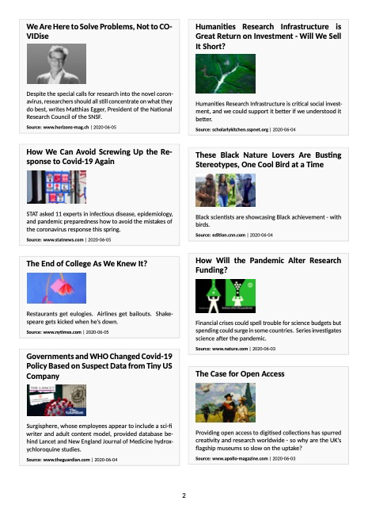

<!-- README.md is generated from README.Rmd. Please edit that file -->

# headliner

<!-- badges: start -->

[](https://github.com/zambujo/headliner/blob/master/LICENSE)
[](https://www.tidyverse.org/lifecycle/#maturing)
[](https://travis-ci.org/zambujo/headliner)
[](https://github.com/zambujo/headliner/actions)


<!-- badges: end -->

`headliner` is a package to publish headlines’ data. In other words, it
provides a static generator for headlines. `headliner` is ideal to
quickly publish and distribute RSS feeds, for instance.

## Installation

The package is not yet on CRAN.

You can install the development version of `headliner` from github
using:

``` r
# install.packages("devtools")
devtools::install_github("zambujo/headliner")
```

## Example

Use this example to publish the contents of a data frame:

``` r
library(headliner)
data(sciencegeist)

sciencegeist <- head(sciencegeist, 20)
build_hd(sciencegeist, 
         title = "Sciencegeist newest posts", 
         save_as = "headlines.html",
         layout = "card")
```


``` r
sciencegeist <- head(sciencegeist, 20)
build_hd(sciencegeist, 
         title = "Sciencegeist newest posts", 
         save_as = "headlines.pdf")
```


